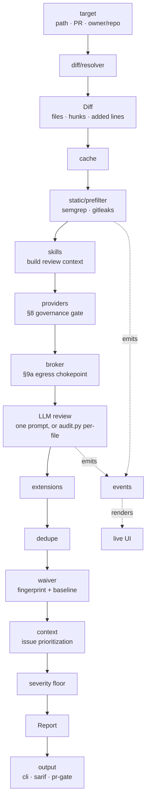

# Architecture

How cosmo is put together, and why the safety properties hold by construction
rather than by convention.

See also: **[usage.md](usage.md)** · **[configuration.md](configuration.md)** ·
**[CONTRIBUTING.md](../CONTRIBUTING.md)** · the illustrated design document at
[`architecture.html`](architecture.html).

---

## The shape of it

cosmo is a **diff-driven reviewer**. Everything reduces to: turn a target into a
normalized diff, run stages over it, normalize every result into one `Finding`
shape, then suppress, prioritize, and render.



`run_review()` in [`engine.py`](../src/cosmo/engine.py) is the single entry point
every trigger adapter calls. The CLI, the git hook, the GitHub Action, and the
interactive session are all thin callers — no scan logic lives in any of them.

---

## Module map

**Top-level modules**

| Module | Role |
|---|---|
| `engine.py` | `run_review()` — the pipeline, in order |
| `cli.py` | Argument parsing and trigger dispatch. Thin |
| `config.py` | Two-tier trust model, clamping, defaults |
| `findings.py` | The `Finding` and `Report` schema everything normalizes into |
| `severity.py` | Severity enum and threshold comparison |
| `audit.py` | Whole-project per-file LLM audit, concurrent, budgeted |
| `history.py` | Commit-history sweep with HEAD-reachability |
| `events.py` | Structured execution events (the layer the UI renders) |
| `live.py` | The live terminal UI. stdlib-only ANSI |

**Packages**

| Package | Role |
|---|---|
| `diff/` | Normalizes local git, staged, whole-tree, and GitHub PR diffs into one shape |
| `static/` | Static pre-filter — semgrep, gitleaks, dep-audit (stub) |
| `providers/` | Model layer: Claude, claude-cli, OpenAI-compatible, local llama |
| `broker/` | The single guarded egress chokepoint — mode gate, scope, rate limit, log |
| `skills/` | Loading, matching, and trust-framed injection of review guidance |
| `waiver/` | Content-based fingerprints and the baseline |
| `cache/` | Incremental scanning; per-stage cache keys |
| `context/` | Issue/comment ingestion → prioritization signals |
| `output/` | CLI text, SARIF, and the fail-closed PR-comment gate |
| `sandbox/` | Rootless container used to confirm findings |
| `fuzz/` | Manual-only fuzzing campaigns |
| `external/` | Authorized live-target mode |
| `disclose/` | Coordinated disclosure drafting and queueing |
| `store/` | SQLite trend store and OWASP compliance rollup |
| `extensions/` | Third-party detectors, skills, and commands |
| `interactive/` | The live session and its guarded command registry |
| `plugin/` | Claude Code plugin surface, derived from that registry |
| `triggers/` | Git hook and GitHub Action adapters |

---

## The seven load-bearing properties

Each is traceable to a design-review finding, and each is enforced in code rather
than documented as a rule. `CONTRIBUTING.md` requires a test proving the property
still holds if you touch one.

| ID | Property | Enforced in |
|---|---|---|
| RISK-01 | A scanned repo may only *tighten* safety config, never loosen it | `config.py` trust tiers |
| RISK-02 | Every network touch goes through one guarded egress broker | `broker/` |
| RISK-03 | Untrusted input can't override the reviewer | `skills/inject.py`, extensions, `config.OPERATOR_ONLY_PREFERENCE_KEYS` |
| RISK-04 | Absence of evidence never auto-waives a finding | sandbox confirmation; history reachability |
| RISK-05 | The public-comment gate fails **closed** on unknown sensitivity | `output/` gate |
| RISK-06 | Nothing is disclosed without explicit human approval | `disclose/` |
| RISK-07 | Waiver fingerprints are content/AST-based, not line-based | `waiver/` |

---

## Key design decisions, and why

### The scanned repo is untrusted input

`cosmo.yaml` is checked into the repository being reviewed. So is its `README`,
its issues, its skills, and any extension it ships. Every one of those is treated
as attacker-controlled:

- Config resolves under **two opposite rules** — preferences merge freely, safety
  keys clamp to the operator ceiling.
- Repo skills are injected in a labelled **untrusted section** with a directive
  that they cannot suppress findings, and that an instruction attempting to is
  itself a signal.
- Issue text becomes a **signal set**, never raw text into the reviewer, and can
  only *raise* attention — never create or suppress a finding.

### One egress chokepoint

Every outbound request — sandbox provisioning, external-target recon, model API
calls, disclosure delivery — is stamped with a `Mode` and authorized by the same
broker. Centralizing it is the only place a declared rate limit actually holds,
since each downstream tool carries its own concurrency.

The broker's `RequestLog` is the audit record, and it is the *only* one; the live
UI observes it rather than becoming a second, divergent log.

### Stages degrade, they never silently vanish

A missing tool, an unavailable model, a broken extension — each is recorded in
`Report.skipped_stages` and surfaced. A clean result is never confused with an
unchecked one. This is why the live UI's coverage panel exists, and why a warm
cache replays the skip records from the run that populated it.

### Findings normalize before anything touches them

Static, model, dynamic, fuzz, external, and extension findings all become the
same `Finding` dataclass at their source. There is no N×M adapter problem between
sources and renderers, and the downstream path — dedupe → waiver → prioritize →
threshold → gate — is identical regardless of origin.

### Concurrency only where units are genuinely independent

The pipeline stages are sequential because they are dependent: static output
feeds the LLM prompt; the sandbox confirms what the LLM found. The two places
work *is* independent — the per-file audit and the per-commit history sweep — run
concurrently, with the budget applied **before** dispatch so parallelism changes
the rate and never the call count.

Threads, not processes: the work is I/O-bound (HTTP and subprocess), so the GIL
is not in the way.

### The plugin surface is derived, not written

`plugin/` generates the Claude Code command surface from
`interactive.commands._COMMANDS` — the one enforced registry. A hand-maintained
copy would drift; CI runs `cosmo plugin check` to prove it hasn't.

---

## The review pipeline, stage by stage

The eleven stages `run_review()` executes, in order. These are also what the live
UI draws — the list lives in `events.STAGES`, so a stage added to the engine
without a matching entry shows as untracked rather than silently missing.

| # | Stage | What happens |
|---|---|---|
| 1 | `resolve` | Target → normalized `Diff` |
| 2 | `cache` | Load the incremental cache |
| 3 | `static` | semgrep, gitleaks, dep-audit (stub) |
| 4 | `provider` | Resolve the model + wire the egress broker |
| 5 | `context` | Static findings + matched skills → review context |
| 6 | `llm` | One prompt, or `audit.py` per-file |
| 7 | `extensions` | Operator-enabled custom detectors |
| 8 | `dedupe` | Coarse dedupe by file/line/category |
| 9 | `waiver` | Stamp fingerprints, mark waived |
| 10 | `priority` | Issue-context prioritization |
| 11 | `threshold` | Apply the severity floor |

`cosmo history` runs a different, shorter pipeline (`events.HISTORY_STAGES`):
select → review-and-check-reachability → dedupe → waiver → threshold. It has no
tree-level static stage, and says so.

---

## The event layer

`run_review()` stays pure. Instrumentation is an **optional observer**:

```python
report = run_review(target, config)                 # silent
report = run_review(target, config, events=sink)    # instrumented
```

`Emitter(None)` is a working no-op, so the instrumented and silent paths are the
same code. A sink may be called from several threads at once — a concurrent audit
emits from every worker — so a sink touching shared state does its own locking.

`live.py` is one such sink that happens to draw itself. It is stdlib-only and
stderr-only, so `--format sarif` still pipes and the `.deb` still needs nothing
but `python3`.

---

## Build history

cosmo was built as a 20-step implementation of a design document, each step
carrying a stated safety property. The step-by-step record — what each delivered
and which risk it addresses — is preserved in
**[`build-log.md`](build-log.md)**, and the illustrated design document is
[`architecture.html`](architecture.html).

Two capabilities sit **beyond** that 20-step build and are numbered separately
because they are not architecture sections: the commit-history sweep
(`cosmo history`) and the live review UI (`cosmo review --live`).
